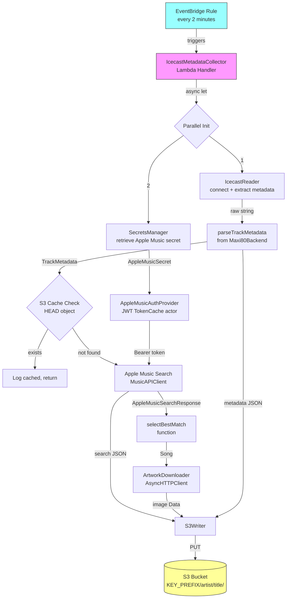

# Design Document: Icecast Metadata Collector

## Overview

The Icecast Metadata Collector is a new AWS Lambda function that runs on a 2-minute EventBridge schedule. Each invocation connects to an Icecast audio stream, extracts the currently playing track metadata via the Icy-MetaData protocol, searches Apple Music for matching song information, downloads the album artwork at full resolution, and stores all three artifacts (metadata, search results, artwork) in S3. An S3 cache check (head object) prevents redundant work for songs already collected.

The new Lambda is a separate executable target (`IcecastMetadataCollector`) that reuses the shared `Maxi80Backend` library for metadata parsing, Apple Music API access, JWT authentication, and AWS service integration. It follows the same patterns established by the existing `Maxi80Lambda` — conditional Foundation imports, `AsyncHTTPClient` for all HTTP, `Region` for AWS configuration, `SecretsManager` for secrets, `AppleMusicAuthProvider` with `TokenCache` actor for JWT caching, and `Logger` configuration from environment variables.

### Key Design Decisions

1. **AsyncHTTPClient for Icecast streaming**: The Icecast reader uses `AsyncHTTPClient` with raw byte-level response body consumption (via `NIOCore` `ByteBuffer`) rather than URLSession. This ensures cross-platform compatibility (macOS + Linux) and allows reading the response body incrementally — essential for the Icy-MetaData protocol where audio bytes and metadata blocks are interleaved.

2. **Song selector as a plain function**: The song selector is an isolated top-level function (`selectBestMatch(_:)`) rather than a protocol. This keeps the design simple and makes future replacement straightforward without protocol ceremony.

3. **S3 cache-first approach**: Before performing any Apple Music API call, artwork download, or S3 upload, the Lambda checks if `metadata.json` already exists at the target S3 key. This avoids redundant API calls and downloads for songs that repeat frequently on the radio.

4. **Parallel initialization**: Icecast stream reading and SecretsManager secret retrieval run concurrently via `async let`, minimizing cold-start latency since neither depends on the other until the Apple Music search step.

5. **Reuse of Maxi80Backend**: The collector reuses `parseTrackMetadata()`, `MusicAPIClient`, `AppleMusicEndpoint`, `AppleMusicSearchType`, `JWTTokenFactory`, `SecretsManager`, `AppleMusicAuthProvider` pattern, and `Region` from the existing library — no duplication.

## Architecture



### Execution Flow

1. EventBridge triggers the Lambda every 2 minutes
2. Lambda starts two concurrent tasks: (a) connect to Icecast stream and extract metadata, (b) retrieve the Apple Music secret from SecretsManager
3. The raw metadata string (e.g., `"Rita Mitsouko - Andy"`) is parsed into `TrackMetadata` using the existing `parseTrackMetadata()` function
4. If both artist and title are nil, log a warning and return early
5. Check S3 for an existing `metadata.json` at `KEY_PREFIX/artist/title/` — if found, log and return early
6. Await the secret (if not already resolved), build the auth provider, search Apple Music
7. If zero results, log a warning and return early
8. Select the best match (first song), download artwork at full resolution
9. Upload three files to S3: `metadata.json`, `search.json`, `artwork.jpg`

## Components and Interfaces

### 1. IcecastMetadataCollector (Lambda Handler)

The `@main` entry point struct conforming to `LambdaHandler`, consistent with the existing `Maxi80Lambda`. The `LambdaHandler` protocol provides an `async init()` which is the natural place for SecretsManager retrieval and other async setup — the runtime manages the lifecycle and ensures init completes before `handle()` is called.

```swift
@main
struct IcecastMetadataCollector: LambdaHandler {
    private let logger: Logger
    private let streamURL: String
    private let authProvider: AppleMusicAuthProvider
    private let httpClient: MusicAPIClient
    private let s3Writer: S3Writer
    private let icecastReader: IcecastReader
    private let artworkDownloader: ArtworkDownloader

    init() async throws { ... }
    func handle(_ event: EventBridgeEvent<CloudwatchDetails.Scheduled>, context: LambdaContext) async throws { ... }

    static func main() async throws {
        let handler = try await IcecastMetadataCollector()
        let runtime = LambdaRuntime(lambdaHandler: handler)
        try await runtime.run()
    }
}
```

The `init()` method (runs once during cold start):
- Configures the logger from `LOG_LEVEL` env var
- Reads `AWS_REGION`, `STREAM_URL`, `S3_BUCKET`, `KEY_PREFIX`, `SECRETS` from environment
- Retrieves the Apple Music secret from SecretsManager (async, runs during cold start)
- Creates `JWTTokenFactory` and `AppleMusicAuthProvider` with `TokenCache` actor (same pattern as existing Lambda)
- Creates `S3Writer`, `IcecastReader`, `ArtworkDownloader`, `MusicAPIClient`

The `handle()` method (runs every invocation):
- Reads the Icecast stream via `IcecastReader`
- Parses metadata, checks S3 cache, searches Apple Music, selects song, downloads artwork, uploads to S3

The `async init()` is the key advantage of `LambdaHandler` over the closure approach — it provides a natural async initialization phase where SecretsManager retrieval happens once during cold start without needing a separate cache actor for the secret itself. The `TokenCache` actor still caches the JWT token across warm invocations.

### 2. IcecastReader

A struct that connects to an Icecast stream and extracts the first non-empty `StreamTitle` metadata.

```swift
struct IcecastReader {
    let logger: Logger
    
    func readMetadata(from streamURL: String) async throws -> String
}
```

Implementation details:
- Creates an `HTTPClientRequest` with the `Icy-MetaData: 1` header
- Executes via `HTTPClient.shared.execute()` with streaming response body
- Reads the `icy-metaint` response header to determine the byte interval
- Iterates over the response body's `AsyncSequence` of `ByteBuffer` chunks, maintaining a byte counter
- After consuming `icy-metaint` audio bytes, reads the length byte (value × 16), then reads that many bytes of metadata
- Extracts `StreamTitle='...'` from the metadata text using string parsing
- Returns the first non-empty StreamTitle value and closes the connection
- Throws `IcecastError.connectionFailed`, `.missingMetaInt`, `.timeout`, or `.noMetadata` on failure

### 3. Song Selector (Function)

A top-level function, not a protocol:

```swift
func selectBestMatch(_ response: AppleMusicSearchResponse) -> Song?
```

Returns the first song from `response.results.songs?.data`, or `nil` if empty.

### 4. ArtworkDownloader

A struct that downloads artwork at full resolution:

```swift
struct ArtworkDownloader {
    let logger: Logger
    
    func download(artwork: Song.Attributes.Artwork) async throws -> Data
}
```

- Replaces `{w}` with `artwork.width` and `{h}` with `artwork.height` in the artwork URL template
- Downloads via `HTTPClient.shared.execute()` 
- Returns the raw image `Data`

### 5. S3Writer

A struct that handles S3 operations using the AWS SDK `S3Client`:

```swift
struct S3Writer {
    let s3Client: S3Client
    let bucket: String
    let keyPrefix: String
    let logger: Logger
    
    func exists(artist: String, title: String) async throws -> Bool
    func writeMetadata(_ metadata: CollectedMetadata, artist: String, title: String) async throws
    func writeSearchResults(_ data: Data, artist: String, title: String) async throws
    func writeArtwork(_ data: Data, artist: String, title: String) async throws
}
```

- `exists()` performs a HEAD object request on `KEY_PREFIX/artist/title/metadata.json`
- Write methods perform PUT object requests to the appropriate S3 keys
- Uses `AWSS3.S3Client` from the aws-sdk-swift package (already a dependency of Maxi80Backend)

### 6. Reused Components from Maxi80Backend

| Component | Usage |
|---|---|
| `parseTrackMetadata()` | Parse raw Icecast metadata string into `TrackMetadata` |
| `TrackMetadata` | Structured artist/title from parsed metadata |
| `MusicAPIClient` | HTTP client for Apple Music API calls |
| `AppleMusicEndpoint.search` | Search endpoint URL construction |
| `AppleMusicSearchType.songs` | Search type parameter |
| `AppleMusicSearchResponse`, `Song` | Response model types |
| `JWTTokenFactory` / `JWTTokenFactoryProtocol` | JWT token generation and validation |
| `AppleMusicSecret` | Secret model for SecretsManager |
| `SecretsManager<AppleMusicSecret>` | AWS SecretsManager client |
| `Region` | AWS region type |
| `HTTPClientProtocol` | Protocol for HTTP client abstraction |

## Data Models

### CollectedMetadata

A `Codable` struct stored as `metadata.json`:

```swift
struct CollectedMetadata: Codable, Sendable {
    let rawMetadata: String      // Original Icecast StreamTitle value
    let artist: String           // Parsed artist name
    let title: String            // Parsed title
    let collectedAt: String      // ISO 8601 timestamp
}
```

### S3 Key Structure

```
<KEY_PREFIX>/<artist>/<title>/metadata.json   — CollectedMetadata JSON
<KEY_PREFIX>/<artist>/<title>/search.json     — Full AppleMusicSearchResponse JSON
<KEY_PREFIX>/<artist>/<title>/artwork.jpg     — Cover image at full resolution
```

### IcecastError

```swift
enum IcecastError: Error {
    case connectionFailed(reason: String)
    case missingMetaInt
    case timeout
    case noMetadata
    case invalidStreamTitle
}
```

### CollectorError

```swift
enum CollectorError: Error {
    case missingEnvironmentVariable(String)
    case emptyMetadata
    case noSearchResults
    case artworkDownloadFailed(reason: String)
    case s3WriteFailed(file: String, reason: String)
    case secretRetrievalFailed(reason: String)
}
```

### Environment Variables

| Variable | Description |
|---|---|
| `STREAM_URL` | Icecast stream URL (e.g., `https://audio1.maxi80.com`) |
| `S3_BUCKET` | S3 bucket name for storing collected data |
| `KEY_PREFIX` | S3 key prefix (e.g., `collected`) |
| `SECRETS` | SecretsManager secret name (e.g., `Maxi80-AppleMusicKey`) |
| `LOG_LEVEL` | Logging level (e.g., `trace`, `debug`, `info`, `error`) |
| `AWS_REGION` | AWS region (e.g., `eu-central-1`) |

### SAM Template Addition

A new `AWS::Serverless::Function` resource for the collector:

```yaml
IcecastMetadataCollector:
    Description: Collects Icecast stream metadata and stores in S3
    Type: AWS::Serverless::Function
    Properties:
        Handler: bootstrap
        Runtime: provided.al2023
        Architectures:
            - arm64
        CodeUri: .
        MemorySize: 128
        Timeout: 115
        LoggingConfig:
            LogFormat: JSON
            ApplicationLogLevel: INFO
            SystemLogLevel: WARN
        Environment:
            Variables:
                STREAM_URL: https://audio1.maxi80.com
                S3_BUCKET: !Ref MetadataBucket
                KEY_PREFIX: collected
                SECRETS: Maxi80-AppleMusicKey
                LOG_LEVEL: info
        Policies:
            - Statement:
                - Effect: Allow
                  Action:
                    - secretsmanager:GetSecretValue
                    - secretsmanager:DescribeSecret
                  Resource: !Sub "arn:aws:secretsmanager:${AWS::Region}:${AWS::AccountId}:secret:Maxi80-*"
                - Effect: Allow
                  Action:
                    - s3:PutObject
                    - s3:HeadObject
                  Resource: !Sub "arn:aws:s3:::${MetadataBucket}/*"
        Events:
            ScheduleEvent:
                Type: Schedule
                Properties:
                    Schedule: rate(2 minutes)
                    Enabled: true
    Metadata:
        BuildMethod: makefile
```

### Makefile Addition

A new build target for the collector Lambda:

```makefile
build-IcecastMetadataCollector:
	swift package --allow-network-connections docker archive --disable-docker-image-update --products IcecastMetadataCollector
	cp .build/plugins/AWSLambdaPackager/outputs/AWSLambdaPackager/IcecastMetadataCollector/bootstrap $(ARTIFACTS_DIR)/
```

### Package.swift Addition

A new executable target:

```swift
.executable(name: "IcecastMetadataCollector", targets: ["IcecastMetadataCollector"]),
// ...
.executableTarget(
    name: "IcecastMetadataCollector",
    dependencies: [
        .product(name: "AWSLambdaRuntime", package: "swift-aws-lambda-runtime"),
        .product(name: "AWSLambdaEvents", package: "swift-aws-lambda-events"),
        .product(name: "AsyncHTTPClient", package: "async-http-client"),
        .product(name: "Logging", package: "swift-log"),
        .target(name: "Maxi80Backend"),
    ]
)
```


## Correctness Properties

*A property is a characteristic or behavior that should hold true across all valid executions of a system — essentially, a formal statement about what the system should do. Properties serve as the bridge between human-readable specifications and machine-verifiable correctness guarantees.*

### Property 1: Icy-MetaData request header

*For any* stream URL string, the HTTP request constructed by `IcecastReader` should contain the header `Icy-MetaData: 1`.

**Validates: Requirements 1.1**

### Property 2: Icecast protocol byte stream parsing (round trip)

*For any* valid icy-metaint value (positive integer), any sequence of audio bytes of that length, and any metadata string, constructing a synthetic Icecast byte stream (audio bytes + length byte + metadata bytes padded to 16-byte boundary) and parsing it with the Icecast reader should produce the original metadata string.

**Validates: Requirements 1.2, 1.3**

### Property 3: StreamTitle extraction

*For any* non-empty string value, wrapping it in the format `StreamTitle='<value>';` and passing it to the StreamTitle parser should return exactly `<value>`.

**Validates: Requirements 1.4**

### Property 4: Song selector returns first element

*For any* non-empty array of `Song` objects in an `AppleMusicSearchResponse`, `selectBestMatch()` should return the first element of the array. For an empty array (or nil songs), it should return nil.

**Validates: Requirements 4.1**

### Property 5: Artwork URL template substitution

*For any* artwork URL template string containing `{w}` and `{h}` placeholders, and any positive integer width and height values, the constructed URL should have `{w}` replaced with the width string and `{h}` replaced with the height string, with no remaining `{w}` or `{h}` placeholders.

**Validates: Requirements 5.1**

### Property 6: S3 key construction

*For any* key prefix, artist name, and title string, the S3 keys generated by `S3Writer` should follow the pattern `<prefix>/<artist>/<title>/metadata.json`, `<prefix>/<artist>/<title>/search.json`, and `<prefix>/<artist>/<title>/artwork.jpg` respectively.

**Validates: Requirements 6.2, 6.3, 6.4**

### Property 7: S3 cache hit skips processing

*For any* artist/title pair where the S3 cache check (`HEAD` on `metadata.json`) returns true, the collector pipeline should not invoke the Apple Music search, artwork download, or any S3 upload operations.

**Validates: Requirements 6.1**

### Property 8: Token cache reuse

*For any* sequence of `authorizationHeader()` calls on an `AppleMusicAuthProvider` where the cached token is still valid, the provider should return the same token string without calling `generateJWTString()` again.

**Validates: Requirements 3.3**

## Error Handling

### Error Categories

| Error | Trigger | Behavior |
|---|---|---|
| `CollectorError.missingEnvironmentVariable` | Required env var not set | Thrown during `init()`, prevents Lambda startup |
| `IcecastError.connectionFailed` | Stream URL unreachable or HTTP error | Thrown from `IcecastReader.readMetadata()`, logged as error |
| `IcecastError.missingMetaInt` | Server response lacks `icy-metaint` header | Thrown from `IcecastReader.readMetadata()`, logged as error |
| `IcecastError.timeout` | Stream reading exceeds timeout | Thrown from `IcecastReader.readMetadata()`, logged as error |
| `IcecastError.noMetadata` | No non-empty StreamTitle found in stream | Thrown from `IcecastReader.readMetadata()`, logged as error |
| `CollectorError.emptyMetadata` | `parseTrackMetadata()` returns nil artist and nil title | Logged as warning, handler returns early (not an error) |
| `CollectorError.noSearchResults` | Apple Music returns zero songs | Logged as warning, handler returns early (not an error) |
| `CollectorError.artworkDownloadFailed` | Artwork URL returns non-200 or empty body | Thrown from `ArtworkDownloader.download()`, logged as error |
| `CollectorError.s3WriteFailed` | S3 PUT object fails | Thrown from `S3Writer`, includes which file failed |
| `CollectorError.secretRetrievalFailed` | SecretsManager call fails | Thrown during `init()`, prevents Lambda startup |

### Error Flow

- **Init-time errors** (missing env vars, secret retrieval failure): These prevent the Lambda from starting. The runtime will report the error and the invocation fails.
- **Per-invocation recoverable conditions** (empty metadata, no search results, cache hit): These are logged as warnings and the handler returns successfully — the Lambda invocation is not marked as failed since these are expected conditions.
- **Per-invocation errors** (stream failure, artwork download failure, S3 write failure): These are thrown from the handler, causing the Lambda invocation to fail. CloudWatch will capture the error via JSON structured logging.

### Retry Strategy

The Lambda does not implement its own retry logic. EventBridge triggers it every 2 minutes, so a transient failure on one invocation will naturally be retried on the next. If the same song is still playing, the next invocation will attempt the same collection. If a different song is playing, the failed song's data is simply not collected (acceptable for a radio metadata collector).

## Testing Strategy

### Dual Testing Approach

Both unit tests and property-based tests are required for comprehensive coverage:

- **Unit tests**: Verify specific examples, edge cases, error conditions, and integration points
- **Property tests**: Verify universal properties across randomly generated inputs

### Property-Based Testing Configuration

- **Library**: [SwiftCheck](https://github.com/typelift/SwiftCheck) or a custom lightweight PBT harness using Swift Testing's parameterized tests with random generators
- **Minimum iterations**: 100 per property test
- **Tag format**: Each property test must include a comment referencing the design property:
  ```
  // Feature: icecast-metadata-collector, Property N: <property text>
  ```
- Each correctness property must be implemented by a single property-based test

### Unit Tests

| Test | Description | Validates |
|---|---|---|
| Icecast connection error handling | Verify `IcecastError.connectionFailed` on bad URL | Req 1.6 |
| Missing icy-metaint header | Verify `IcecastError.missingMetaInt` when header absent | Req 1.7 |
| Empty metadata skip | Verify pipeline skips when artist and title are both nil | Req 2.2 |
| Zero search results skip | Verify pipeline skips when Apple Music returns no songs | Req 3.5 |
| Artwork download failure | Verify `CollectorError.artworkDownloadFailed` on HTTP error | Req 5.3 |
| S3 upload failure | Verify `CollectorError.s3WriteFailed` with file name in error | Req 6.6 |
| Missing environment variable | Verify `CollectorError.missingEnvironmentVariable` | Req 7.5 |
| First metadata extraction stops reading | Verify reader returns after first valid StreamTitle | Req 8.3 |

### Property Tests

| Test | Property | Validates |
|---|---|---|
| Icy-MetaData header always present | Property 1 | Req 1.1 |
| Icecast byte stream round trip | Property 2 | Req 1.2, 1.3 |
| StreamTitle format extraction | Property 3 | Req 1.4 |
| Song selector returns first | Property 4 | Req 4.1 |
| Artwork URL substitution | Property 5 | Req 5.1 |
| S3 key construction pattern | Property 6 | Req 6.2, 6.3, 6.4 |
| Cache hit skips processing | Property 7 | Req 6.1 |
| Token cache reuse | Property 8 | Req 3.3 |

### Test Dependencies

Tests should use mock implementations for external services:
- `MockHTTPClient` (already exists in test suite) for Apple Music API and artwork download
- Mock S3 client for S3 operations
- Synthetic byte streams for Icecast protocol testing (no real stream connection needed)
- `MockJWTTokenFactory` (already exists in test suite) for token caching tests
