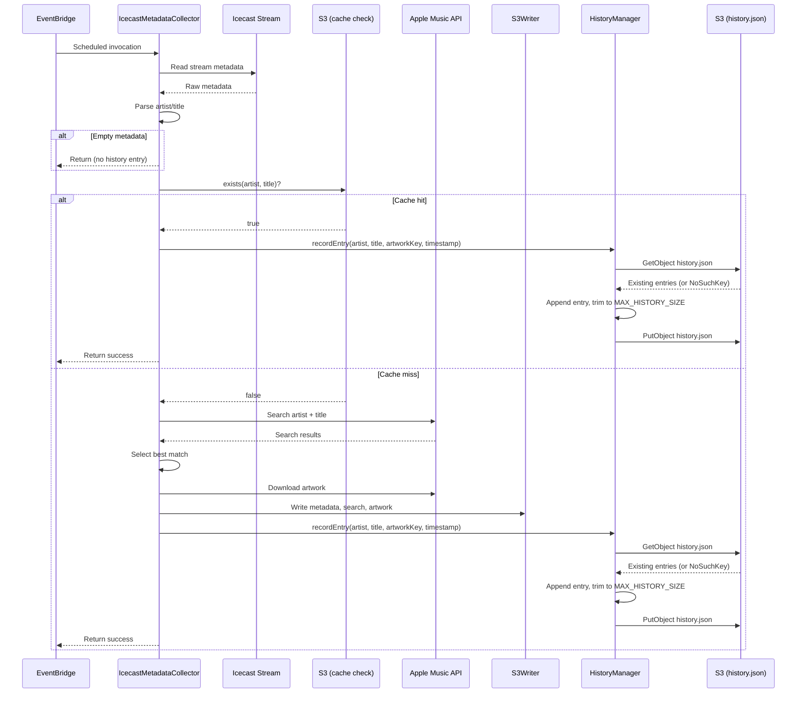

# Design Document: Lookup History

## Overview

The Lookup History feature extends the existing `IcecastMetadataCollector` Lambda to maintain a rolling JSON history of recently identified tracks. After each successful track identification (whether from S3 cache or a fresh Apple Music fetch), a new `HistoryEntry` is appended to a shared `history.json` file in S3. The file is capped at a configurable number of entries (`MAX_HISTORY_SIZE`, default 100) and is designed for direct consumption by an iOS client.

The design introduces a single new component — `HistoryManager` — that encapsulates the read-modify-write cycle against S3. All history operations are non-fatal: failures are logged but never propagate to the Lambda's return value.

## Architecture

The feature slots into the existing Lambda pipeline as a final step after track identification:



Key architectural decisions:

1. **HistoryManager is a separate struct** in its own file (`HistoryManager.swift`), keeping history logic isolated from the main pipeline and S3Writer.
2. **HistoryManager receives its own `S3Client` reference** (the same instance used by S3Writer) plus bucket/keyPrefix, rather than going through S3Writer. This avoids coupling history semantics to the existing writer's API.
3. **The artwork S3 key is passed in by the caller** (Lambda.swift). HistoryManager never constructs artwork paths — S3Writer.buildKey is the single source of truth for key construction.
4. **Non-fatal error handling** is enforced at the call site in Lambda.swift via a do/catch that logs and continues.

## Components and Interfaces

### HistoryEntry (Codable, Sendable)

A single history record. Stored as an element of the `entries` array in `history.json`.

```swift
struct HistoryEntry: Codable, Sendable, Equatable {
    let artist: String
    let title: String
    let artwork: String    // Full S3 key, e.g. "collected/ArtistName/SongTitle/artwork.jpg"
    let timestamp: String  // ISO 8601 UTC, e.g. "2025-01-15T14:30:00Z"
}
```

### HistoryFile (Codable, Sendable)

The top-level wrapper object for the JSON file. Using a wrapper object (rather than a bare array) allows the format to be extended with additional top-level keys in the future.

```swift
struct HistoryFile: Codable, Sendable, Equatable {
    var entries: [HistoryEntry]
}
```

### HistoryManager

Encapsulates the read-modify-write cycle for `history.json`.

```swift
struct HistoryManager {
    let s3Client: S3Client
    let bucket: String
    let keyPrefix: String
    let maxHistorySize: Int
    let logger: Logger

    /// Records a new history entry. Non-throwing — errors are logged internally.
    func recordEntry(artist: String, title: String, artworkKey: String, timestamp: String) async

    /// Reads the existing history file from S3. Returns an empty HistoryFile if the file doesn't exist.
    /// Throws on other S3 errors.
    func readHistory() async throws -> HistoryFile

    /// Writes the history file to S3.
    func writeHistory(_ history: HistoryFile) async throws

    /// Appends an entry and trims to maxHistorySize. Pure function, no I/O.
    static func appendAndTrim(entry: HistoryEntry, to history: HistoryFile, maxSize: Int) -> HistoryFile
}
```

The `recordEntry` method is the public API called from Lambda.swift. It internally:
1. Calls `readHistory()` — on failure (other than NoSuchKey), logs the error and starts with an empty `HistoryFile`.
2. Calls `appendAndTrim(entry:to:maxSize:)` to produce the updated file.
3. Calls `writeHistory(_:)` — on failure, logs the error and returns.

The `appendAndTrim` method is a static pure function to facilitate property-based testing without S3 dependencies.

### Lambda.swift Changes

The `IcecastMetadataCollector.init()` will:
- Read `MAX_HISTORY_SIZE` from the environment (default 100).
- Instantiate `HistoryManager` with the same `S3Client`, bucket, keyPrefix, maxHistorySize, and logger.

The `handle(_:context:)` method will call `historyManager.recordEntry(...)` after successful track identification in both the cache-hit and cache-miss paths. The artwork key is built using `S3Writer.buildKey(prefix:artist:title:file:)`.

```swift
// After successful track identification (both cache-hit and cache-miss paths):
let artworkKey = S3Writer.buildKey(prefix: s3Writer.keyPrefix, artist: artist, title: title, file: "artwork.jpg")
let timestamp = Date.now.formatted(.iso8601)
await historyManager.recordEntry(artist: artist, title: title, artworkKey: artworkKey, timestamp: timestamp)
```

**Note on ISO 8601 formatting:** Use `Date.ISO8601FormatStyle` (via `Date.now.formatted(.iso8601)`) instead of `ISO8601DateFormatter()`. The `FormatStyle` API is part of `FoundationEssentials`, works on Linux, and is `Sendable`. The older `ISO8601DateFormatter` class is not `Sendable` and may not be available on Linux. The existing `Lambda.swift` already uses `ISO8601DateFormatter()` for `CollectedMetadata.collectedAt` — this should also be migrated to `Date.now.formatted(.iso8601)` as part of this feature's implementation.

### template.yaml Changes

- Add `s3:GetObject` to the existing IAM policy for `IcecastMetadataCollector`.
- Add `MAX_HISTORY_SIZE: "100"` to the environment variables.

## Data Models

### history.json Schema

```json
{
  "entries": [
    {
      "artist": "Duran Duran",
      "title": "Is there something i should know",
      "artwork": "collected/Duran Duran/Is there something i should know/artwork.jpg",
      "timestamp": "2025-07-15T14:30:00Z"
    },
    {
      "artist": "Culture Club",
      "title": "Miss me blind",
      "artwork": "collected/Culture Club/Miss me blind/artwork.jpg",
      "timestamp": "2025-07-15T14:28:00Z"
    }
  ]
}
```

Entries are ordered newest-last (appended to the end of the array). When trimming, the oldest entries (beginning of the array) are removed.

### S3 Layout

```
<KEY_PREFIX>/
├── history.json                          ← NEW: the history file
├── <Artist1>/
│   └── <Title1>/
│       ├── metadata.json
│       ├── search.json
│       └── artwork.jpg
├── <Artist2>/
│   └── <Title2>/
│       ├── metadata.json
│       ├── search.json
│       └── artwork.jpg
└── ...
```

### Serialization

- `JSONEncoder` with `.sortedKeys` output formatting for deterministic output.
- `JSONDecoder` with default settings.
- Both `HistoryEntry` and `HistoryFile` conform to `Codable` and `Sendable`.
- The `timestamp` field uses ISO 8601 UTC format string (not `Date` — avoids encoder date strategy configuration and keeps the JSON human-readable).


## Correctness Properties

*A property is a characteristic or behavior that should hold true across all valid executions of a system — essentially, a formal statement about what the system should do. Properties serve as the bridge between human-readable specifications and machine-verifiable correctness guarantees.*

### Property 1: Serialization round-trip

*For any* valid `HistoryFile` containing any number of `HistoryEntry` objects with arbitrary non-empty string fields, encoding to JSON and decoding back should produce an equal `HistoryFile`.

**Validates: Requirements 7.1, 1.4**

### Property 2: Serialized JSON structure contains required keys

*For any* valid `HistoryEntry`, encoding it to JSON should produce a JSON object containing exactly the keys `artist`, `title`, `artwork`, and `timestamp`, all with string values.

**Validates: Requirements 1.1, 1.2**

### Property 3: Size invariant after append-and-trim

*For any* valid `HistoryFile` with `n` entries, any valid `HistoryEntry`, and any `maxSize >= 1`, calling `appendAndTrim` should produce a `HistoryFile` with exactly `min(n + 1, maxSize)` entries.

**Validates: Requirements 2.1, 4.3**

### Property 4: Ordering — new entry is last, oldest entries are trimmed first

*For any* valid `HistoryFile` and any valid `HistoryEntry`, after `appendAndTrim`, the last element of the resulting entries array should be the newly appended entry, and the preceding entries should be a suffix of the original entries array.

**Validates: Requirements 2.3, 4.4**

### Property 5: Duplicate entries are preserved

*For any* valid `HistoryFile` already containing an entry with a given artist and title, appending a new entry with the same artist and title should result in both entries being present in the output (the original is not replaced or deduplicated).

**Validates: Requirements 2.2**

## Error Handling

All history operations are wrapped in non-fatal error handling:

| Scenario | Behavior |
|---|---|
| `history.json` does not exist in S3 (NoSuchKey) | Treated as empty history; create new file with single entry |
| S3 GetObject fails (other error) | Log error, proceed with empty history (single-entry file) |
| S3 PutObject fails | Log error, Lambda continues and returns success |
| JSON decode fails (corrupted file) | Log error, proceed with empty history (single-entry file) |
| `MAX_HISTORY_SIZE` env var missing | Use default value of 100 |
| `MAX_HISTORY_SIZE` env var is not a valid integer | Use default value of 100, log warning |

The `recordEntry` method in `HistoryManager` is non-throwing. It catches all errors internally and logs them. Lambda.swift calls it with a simple `await` — no do/catch needed at the call site.

Error types: No new error enum cases are needed. History errors are logged directly using the existing `Logger` and are never propagated.

## Testing Strategy

### Property-Based Tests (Swift Testing with parameterized tests)

Each correctness property is implemented as a parameterized `@Test` using Swift Testing's `arguments:` parameter with 100+ randomly generated test cases. The project already uses this pattern (see `S3WriterTests`).

Property-based testing library: **Swift Testing framework** with parameterized tests and a custom random generator (consistent with existing test patterns in the project).

Each property test must:
- Run a minimum of 100 iterations
- Reference its design document property in a comment
- Use the tag format: `Feature: lookup-history, Property {number}: {property_text}`

| Property | Test approach |
|---|---|
| Property 1: Serialization round-trip | Generate random `HistoryFile` instances, encode → decode → assert equality |
| Property 2: JSON structure | Generate random `HistoryEntry` instances, encode, parse raw JSON, assert keys present |
| Property 3: Size invariant | Generate random histories of varying sizes and random maxSize values, call `appendAndTrim`, assert count = `min(n+1, maxSize)` |
| Property 4: Ordering | Generate random histories, call `appendAndTrim`, assert last entry is the new one and preceding entries are a suffix of the original |
| Property 5: Duplicates preserved | Generate random histories, insert a duplicate entry, assert both copies exist |

### Unit Tests (Swift Testing)

Unit tests cover specific examples, edge cases, and integration scenarios:

- First-run scenario: `appendAndTrim` with empty `HistoryFile` produces exactly one entry
- Trimming at boundary: history at exactly `maxSize` entries, append one, verify count stays at `maxSize`
- S3 key path: verify `HistoryManager` uses `<keyPrefix>/history.json` as the S3 key
- Default `MAX_HISTORY_SIZE`: verify default of 100 when env var is absent
- Error recovery: mock S3 read failure → verify `recordEntry` still produces a valid single-entry file
- Error non-fatality: mock S3 write failure → verify `recordEntry` returns without throwing

### Test File Location

All tests go in `Tests/Maxi80BackendTests/HistoryManagerTests.swift`, following the existing test organization pattern.
