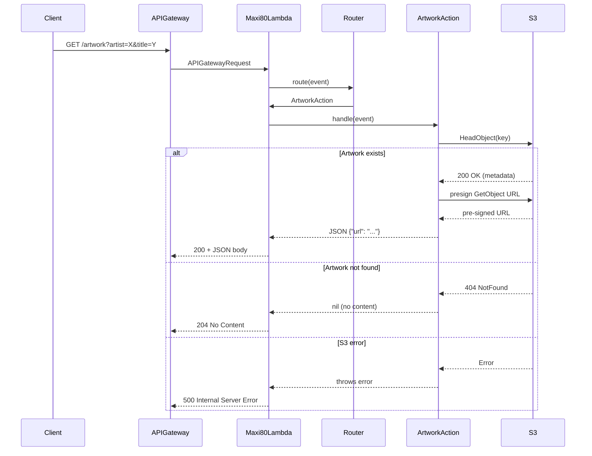

# Design Document: Replace Search with Artwork Endpoint

## Overview

This design replaces the existing `/search` endpoint in Maxi80Lambda with a new `/artwork` endpoint. The `/search` endpoint currently proxies Apple Music search requests, but this functionality has been absorbed by the IcecastMetadataCollector Lambda, which stores artwork in S3. The new `/artwork` endpoint checks for artwork existence in S3 via `HeadObject` and returns a pre-signed S3 URL if the artwork exists, or 204 No Content if it does not.

The change simplifies the Lambda initialization by removing the Apple Music HTTP client, SecretsManager, and auth provider dependencies. The only new dependency is an S3 client for HeadObject and pre-signed URL generation.

### Key Design Decisions

1. **Protocol-based S3 client**: Introduce an `S3ClientProtocol` to abstract S3 operations (HeadObject + pre-signed URL generation), enabling testability via a mock. This follows the existing `HTTPClientProtocol` pattern.
2. **Pre-signed URL via AWS SDK for Swift**: Use `S3Client.getObject(input:presignURL:)` from the AWS SDK to generate pre-signed GetObject URLs. The SDK natively supports this.
3. **Configurable expiration**: The pre-signed URL expiration is read from the `URL_EXPIRATION` environment variable (in seconds), defaulting to 3600 (1 hour).
4. **204 No Content for missing artwork**: When artwork doesn't exist, return 204 with no body. This is a clean signal to the client that the request was valid but no artwork is available.
5. **S3 key construction reuses existing convention**: The S3 key pattern `{prefix}/{artist}/{title}/artwork.jpg` matches what IcecastMetadataCollector writes via `buildS3Key`.

## Architecture



### Component Changes Summary

| Component | Change |
|---|---|
| `Maxi80Endpoint` | Replace `.search` with `.artwork` (path `/artwork`) |
| `SearchAction` | Remove entirely |
| `ArtworkAction` | New action: HeadObject check + pre-signed URL generation |
| `Lambda.swift` | Remove HTTPClient/SecretsManager/AuthProvider init; add S3 client init |
| `LambdaError.swift` | Remove `cantAccessMusicAPISecret` and `noAuthenticationToken`; add S3-related errors |
| `template.yaml` | Remove SecretsManager policy from Maxi80Lambda; add S3 policy + env vars |

## Components and Interfaces

### S3ClientProtocol

A protocol abstracting the two S3 operations needed by ArtworkAction, enabling dependency injection and testability.

```swift
public protocol S3ClientProtocol: Sendable {
    /// Check if an object exists at the given bucket/key.
    /// Returns true if exists, false if not found.
    /// Throws for unexpected S3 errors.
    func objectExists(bucket: String, key: String) async throws -> Bool

    /// Generate a pre-signed GetObject URL for the given bucket/key with the specified expiration.
    func presignedGetURL(bucket: String, key: String, expiration: TimeInterval) async throws -> String
}
```

A concrete implementation wraps `AWSS3.S3Client`:

```swift
public struct AWSS3ClientAdapter: S3ClientProtocol {
    private let s3Client: S3Client

    public init(s3Client: S3Client) {
        self.s3Client = s3Client
    }

    public func objectExists(bucket: String, key: String) async throws -> Bool {
        do {
            _ = try await s3Client.headObject(input: HeadObjectInput(bucket: bucket, key: key))
            return true
        } catch is AWSS3.NotFound {
            return false
        }
        // Other errors propagate as-is
    }

    public func presignedGetURL(bucket: String, key: String, expiration: TimeInterval) async throws -> String {
        let input = GetObjectInput(bucket: bucket, key: key)
        let presignedRequest = try await s3Client.presignGetObject(
            input: input,
            expiration: expiration
        )
        return presignedRequest.url.absoluteString
    }
}
```

### ArtworkAction

Replaces `SearchAction`. Handles `GET /artwork` requests.

```swift
public struct ArtworkAction: Action {
    public let endpoint: Maxi80Endpoint = .artwork
    public let method: HTTPRequest.Method = .get

    private let s3Client: S3ClientProtocol
    private let bucket: String
    private let keyPrefix: String
    private let urlExpiration: TimeInterval
    private let logger: Logger

    public init(
        s3Client: S3ClientProtocol,
        bucket: String,
        keyPrefix: String,
        urlExpiration: TimeInterval,
        logger: Logger
    )

    public func handle(event: APIGatewayRequest) async throws -> Data
}
```

The `handle` method:
1. Extracts `artist` and `title` from query parameters (throws `ActionError.missingParameter` if absent).
2. Builds the S3 key: `"{keyPrefix}/{artist}/{title}/artwork.jpg"`.
3. Calls `s3Client.objectExists(bucket:key:)`.
4. If exists: calls `s3Client.presignedGetURL(bucket:key:expiration:)` and returns JSON `{"url": "<url>"}`.
5. If not exists: returns an empty `Data()` — the Lambda handler interprets this as 204.

### ArtworkResponse

A simple Codable struct for the JSON response:

```swift
public struct ArtworkResponse: Codable, Sendable {
    public let url: String
}
```

### Modified Maxi80Endpoint

```swift
public enum Maxi80Endpoint: String, CaseIterable {
    case station = "/station"
    case artwork = "/artwork"
}
```

### Modified Lambda.swift

The initializer changes from:

```swift
init(musicAPIClient:, tokenFactory:, logger:) async throws
```

to:

```swift
init(s3Client: S3ClientProtocol? = nil, logger: Logger? = nil) async throws
```

- Reads `S3_BUCKET`, `KEY_PREFIX`, `URL_EXPIRATION` from environment.
- Creates an `AWSS3ClientAdapter` wrapping `AWSS3.S3Client` (unless a mock is injected).
- Registers `[StationAction, ArtworkAction]` with the Router.
- No longer creates HTTPClient, SecretsManager, or AppleMusicAuthProvider.

### Modified Lambda handle method

The `handle` method needs a small change: when `ArtworkAction` returns empty data (artwork not found), return 204 No Content with no body and no content-type header.

```swift
let responseData = try await action.handle(event: event)

if responseData.isEmpty {
    return APIGatewayResponse(statusCode: .noContent)
} else {
    return APIGatewayResponse(
        statusCode: .ok,
        headers: ["content-type": "application/json"],
        body: String(data: responseData, encoding: .utf8)
    )
}
```

### Modified template.yaml (Maxi80Lambda only)

- Remove `SECRETS` env var.
- Add `S3_BUCKET: !Ref MetadataBucket`, `KEY_PREFIX: v2`, `URL_EXPIRATION: 3600`.
- Remove SecretsManager IAM policy.
- Add S3 IAM policy: `s3:GetObject` and `s3:HeadObject` on `arn:aws:s3:::${MetadataBucket}/*`.

## Data Models

### ArtworkResponse

| Field | Type | Description |
|---|---|---|
| `url` | `String` | Pre-signed S3 GetObject URL for the artwork JPEG |

### S3 Key Pattern

The artwork S3 key follows the existing convention from IcecastMetadataCollector's `buildS3Key`:

```
{KEY_PREFIX}/{artist}/{title}/artwork.jpg
```

Example: `v2/Duran Duran/Rio/artwork.jpg`

### Environment Variables (Maxi80Lambda)

| Variable | Required | Default | Description |
|---|---|---|---|
| `S3_BUCKET` | Yes | — | S3 bucket name containing artwork |
| `KEY_PREFIX` | No | `v2` | S3 key prefix |
| `URL_EXPIRATION` | No | `3600` | Pre-signed URL expiration in seconds |
| `LOG_LEVEL` | No | `error` | Logger level |
| `AWS_REGION` | No | `eu-central-1` | AWS region |


## Correctness Properties

*A property is a characteristic or behavior that should hold true across all valid executions of a system — essentially, a formal statement about what the system should do. Properties serve as the bridge between human-readable specifications and machine-verifiable correctness guarantees.*

### Property 1: S3 key construction

*For any* non-empty artist string and non-empty title string, when ArtworkAction handles a request with those query parameters, the S3 key passed to the HeadObject check shall be exactly `"{keyPrefix}/{artist}/{title}/artwork.jpg"`.

**Validates: Requirements 2.1, 3.3**

### Property 2: Artwork exists returns JSON with pre-signed URL

*For any* artist and title where the S3 object exists, the ArtworkAction shall return non-empty data that decodes to a JSON object containing a `url` field with a non-empty string value.

**Validates: Requirements 2.2, 3.1, 3.2**

### Property 3: Artwork not found returns empty response

*For any* artist and title where the S3 object does not exist, the ArtworkAction shall return empty data (which the Lambda handler maps to HTTP 204 No Content with no body).

**Validates: Requirements 2.3, 3.5**

### Property 4: Pre-signed URL uses configured expiration

*For any* configured expiration value (positive integer), when ArtworkAction generates a pre-signed URL, the expiration passed to the S3 client shall equal the configured value.

**Validates: Requirements 3.4**

### Property 5: Unrecognized paths return path-not-found

*For any* path string that does not match a registered endpoint, the Router shall return a `pathNotFound` error.

**Validates: Requirements 5.4**

### Property 6: Unsupported methods return method-not-allowed

*For any* recognized endpoint path paired with an HTTP method not supported by that endpoint's action, the Router shall return a `methodNotAllowed` error.

**Validates: Requirements 5.5**

### Property 7: S3 errors propagate as internal server error

*For any* S3 error that is not a "not found" condition, the ArtworkAction shall throw an error (which the Lambda handler maps to HTTP 500).

**Validates: Requirements 6.1**

## Error Handling

| Scenario | HTTP Status | Response |
|---|---|---|
| Missing `artist` query parameter | 400 Bad Request | `"Missing required parameter: artist"` |
| Missing `title` query parameter | 400 Bad Request | `"Missing required parameter: title"` |
| Artwork not found in S3 | 204 No Content | No body |
| S3 HeadObject unexpected error | 500 Internal Server Error | Error description |
| S3 pre-sign unexpected error | 500 Internal Server Error | Error description |
| Unrecognized path | 404 Not Found | `"Path not found: {path}"` |
| Unsupported HTTP method | 405 Method Not Allowed | `"Method {method} not allowed for path: {path}"` |

Error handling reuses the existing patterns:
- `ActionError.missingParameter` for missing query params (already exists, handled in Lambda's catch block as 400).
- `RouterError.pathNotFound` and `RouterError.methodNotAllowed` (already exist, unchanged).
- S3 errors from `S3ClientProtocol` propagate as untyped errors, caught by the Lambda handler's generic catch block and returned as 500.

## Testing Strategy

### Property-Based Testing

Use the [SwiftCheck](https://github.com/typelift/SwiftCheck) library for property-based testing in Swift. Each property test runs a minimum of 100 iterations with randomly generated inputs.

Each property-based test must be tagged with a comment referencing the design property:
```swift
// Feature: replace-search-with-image-endpoint, Property 1: S3 key construction
```

Property tests focus on:
- **Property 1**: Generate random non-empty artist/title strings → verify the S3 key passed to the mock matches the expected pattern.
- **Property 2**: Generate random artist/title strings, configure mock to return "exists" → verify response decodes to `ArtworkResponse` with non-empty `url`.
- **Property 3**: Generate random artist/title strings, configure mock to return "not exists" → verify response is empty `Data`.
- **Property 4**: Generate random positive integer expirations → verify the mock receives the correct expiration value.
- **Property 5**: Generate random strings that are not `/station` or `/artwork` → verify Router returns `pathNotFound`.
- **Property 6**: Generate random non-GET HTTP methods for `/artwork` and `/station` → verify Router returns `methodNotAllowed`.
- **Property 7**: Generate random `Error` values, configure mock to throw → verify ArtworkAction throws.

### Unit Testing

Unit tests complement property tests for specific examples and edge cases. Use the Swift Testing framework (`@Test`, `#expect`).

Unit tests focus on:
- **Endpoint enum**: `.artwork` has rawValue `/artwork`, `.search` no longer exists, `from(path:)` works correctly.
- **Missing parameters**: Request without `artist` throws `ActionError.missingParameter(name: "artist")`. Same for `title`.
- **Lambda initialization**: Verify Lambda initializes with a mock S3 client without requiring HTTPClient or SecretsManager.
- **StationAction unchanged**: GET `/station` still returns `Station.default` as JSON.
- **Integration**: End-to-end routing of `GET /artwork?artist=X&title=Y` through Router → ArtworkAction → mock S3 → response.

### Mock S3 Client

Follow the existing `MockHTTPClient` pattern:

```swift
public final class MockS3Client: S3ClientProtocol, @unchecked Sendable {
    private var existsResults: [Bool] = []
    private var presignedURLs: [String] = []
    private var errors: [Error] = []
    private var callRecords: [(bucket: String, key: String)] = []
    private var presignExpirations: [TimeInterval] = []

    public func objectExists(bucket: String, key: String) async throws -> Bool { ... }
    public func presignedGetURL(bucket: String, key: String, expiration: TimeInterval) async throws -> String { ... }

    // Test helpers
    public func setExists(_ exists: Bool) { ... }
    public func setPresignedURL(_ url: String) { ... }
    public func setError(_ error: Error) { ... }
    public func getCallRecords() -> [(bucket: String, key: String)] { ... }
    public func getPresignExpirations() -> [TimeInterval] { ... }
}
```
